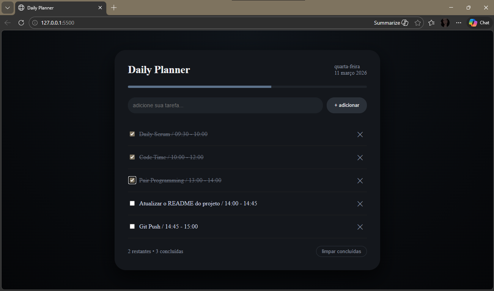

# 📅 Daily Planner


Um planner diário interativo para organizar tarefas do dia a dia. 
O projeto possui um design tema escuro e funcionalidades completas de gerenciamento de tarefas.

## 📸 Preview



## ✨ Funcionalidades

- ✅ **Adicionar tarefas** - Crie novas tarefas rapidamente
- ✅ **Marcar como concluída** - Checkbox interativo com efeito visual
- ✅ **Barra de progresso** - Acompanhe visualmente seu avanço
- ✅ **Contador dinâmico** - Veja quantas tarefas faltam
- ✅ **Persistência de dados** - Suas tarefas ficam salvas mesmo após fechar o navegador
- ✅ **Data automática** - Exibe dia e data atual
- ✅ **Limpar concluídas** - Remova todas as tarefas finalizadas de uma vez
- ✅ **Design responsivo** - Funciona em celular, tablet e desktop

## 🛠️ Tecnologias Utilizadas

- **HTML5** - Estrutura semântica
- **CSS3** - Estilização com:
  - Flexbox
  - Gradientes radiais
  - Animações CSS
  - Design responsivo
- **JavaScript (Vanilla)** - Toda a lógica sem frameworks
- **LocalStorage API** - Persistência dos dados no navegador
- **Google Fonts** - Tipografia Sawarabi Mincho

## 🎨 Layout

O design apresenta:
- Tema escuro moderno com gradiente radial
- Card com efeito glassmorphism
- Animações suaves de entrada
- Interface minimalista e intuitiva

## 🚀 Como usar

### 📋 Pré-requisitos
- Navegador moderno (Chrome, Firefox, Edge, Safari)
- JavaScript habilitado

### 🔧 Instalação

1. Clone este repositório
```bash
git clone https://github.com/SEU-USUARIO/daily-planner.git
